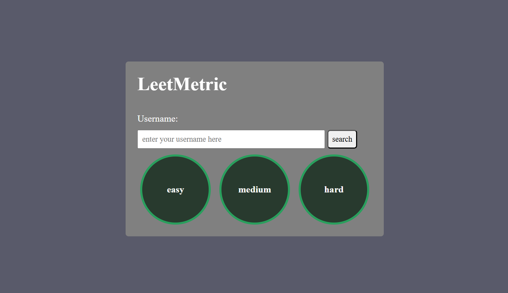

# LeetMetric

A simple and interactive web application that allows users to view their **LeetCode** problem-solving statistics by entering their LeetCode username. The application fetches data from a public API and presents it through intuitive circular progress indicators and statistics cards.

---

## Preview

The application displays:

* Solved Easy, Medium, and Hard problems
* Overall submissions
* Easy submissions
* Medium submissions
* Hard submissions
* Visual progress indicators for each difficulty level

---

## Features

* Search any valid LeetCode username
* Username validation using Regular Expressions
* Fetches live LeetCode statistics using a public API
* Displays solved problems by difficulty
* Circular progress indicators using CSS Conic Gradients
* Dynamic statistics cards
* Responsive and clean user interface
* Error handling for invalid usernames and failed requests
* Built with modern JavaScript using `async/await`

---

## Technologies Used

* HTML5
* CSS3
* JavaScript (ES6)
* Fetch API
* LeetCode Stats API

---

## Project Structure

```
LeetMetric/
│
├── index.html
├── style.css
├── script.js
└── README.md
```

---

## How It Works

1. Enter a valid LeetCode username.
2. Click the **Search** button.
3. The application sends a request to the LeetCode Stats API.
4. User statistics are fetched asynchronously.
5. Progress circles and submission cards are updated dynamically.

---

## Installation

Clone the repository:

```bash
git clone https://github.com/BSSE24040/LeetMetric.git
```

Navigate to the project folder:

```bash
cd LeetMetric
```

Open `index.html` in your browser.

No additional dependencies or installation are required.

---

## API Used

The project uses the public **LeetCode Stats API** to retrieve user statistics.

Example request:

```
https://leetcode-stats-api.herokuapp.com/{username}
```

Replace `{username}` with any valid LeetCode username.

---

## Screenshot


```

---

## Future Improvements

* Dark/Light mode
* Loading animations
* Search history
* User profile information
* Contest rating and ranking
* Acceptance rate visualization
* Responsive mobile optimization
* Better error messages
* API caching

---

## Learning Outcomes

This project helped strengthen understanding of:

* DOM Manipulation
* JavaScript Event Handling
* Asynchronous Programming
* Fetch API
* CSS Flexbox
* CSS Conic Gradients
* Dynamic UI Updates
* Form Validation
* Error Handling

---

## Author

**Muhammad Mahad Ashfaq**

Software Engineering Student

---

## License

This project is intended for educational and learning purposes.
